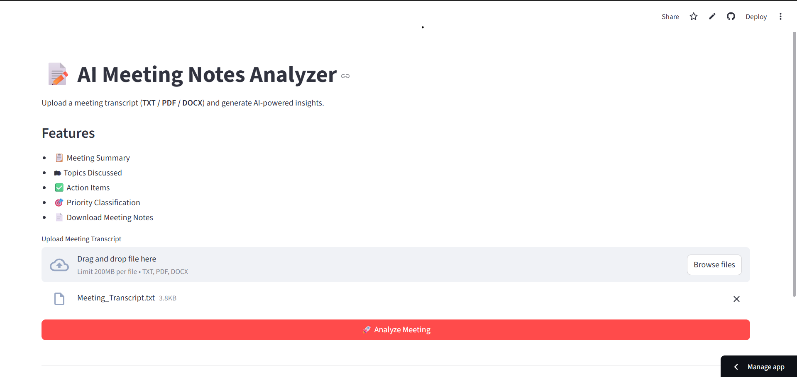

#  AI Meeting Notes Analyzer using LangGraph

> AI-powered meeting transcript analyzer built with **LangGraph, LangChain, Qwen2.5-0.5B, ChromaDB, and Streamlit**.

[](https://ai-meeting-notes-analyzer-langgraph-9pdygevpezzwaav8qrm63l.streamlit.app/)
[](https://github.com/ARCHITTOMAR15/ai-meeting-notes-analyzer-langgraph)

---

## 📌 Overview

This project converts **TXT, PDF, and DOCX meeting transcripts** into structured meeting reports using an **Agentic AI workflow** built with LangGraph.

The application automatically generates:

- 📝 Meeting Summary
- 📚 Key Discussion Topics
- ✅ Action Items
- 👤 Task Owners
- 🎯 Priority Classification


---

##  Features

| Feature | Description |
|---------|-------------|
| Meeting Summary | Generates a concise executive summary. |
|  Topic Extraction | Identifies the main discussion topics. |
|  Action Items | Extracts tasks and responsible owners. |
|  Priority Classification | Classifies tasks into High, Medium, or Low priority. |
| 📥 Multi-format Upload | Supports TXT, PDF, and DOCX transcripts. |


---

## 🧠 Agentic AI Workflow

```text
Meeting Transcript
        │
        ▼
   Input Node
        │
        ▼
 Topic Extraction Agent
        │
        ▼
 Meeting Summary Agent
        │
        ▼
 Action Item Agent
        │
        ▼
 Priority Classification Agent
        │
        ▼
 Embedding Generation
        │
        ▼
 Faiss Vector Store
        │
        ▼
 RAG Chatbot (Qwen2.5-0.5B)
        │
        ▼
 Structured Meeting Report
```

---

##  Tech Stack

| Technology | Purpose |
|------------|---------|
| Python 3.11 | Backend Development |
| LangGraph | Multi-Agent Workflow Orchestration |
| LangChain | Prompt Engineering & RAG Pipeline |
| Qwen2.5-0.5B Instruct | Open-source LLM |
| Sentence Transformers | Embedding Model |
| Faiss | Vector Database |
| Hugging Face Transformers | Model Inference |
| Streamlit | Interactive Web UI |

---

##  Application Preview

## 📸 Application Preview

<p align="center">
  
</p>


##  Skills Demonstrated

- Agentic AI using LangGraph
- Retrieval-Augmented Generation (RAG)
- Vector Databases (FAISS)
- Open-source LLM Deployment
- Prompt Engineering
- Streamlit Application Development

---

##  Future Improvements

- Speaker-wise meeting insights.
- Multilingual transcript support.
- Sentiment analysis.
- PDF meeting report generation.
- Cloud vector database integration.

---

##  Author

**Archit Tomar**

AI & Machine Learning Engineer focused on building production-ready Generative AI applications using **LangGraph, LangChain, RAG, LLMs, and Streamlit**.

⭐ If you like this project, consider giving it a **Star** on GitHub.
